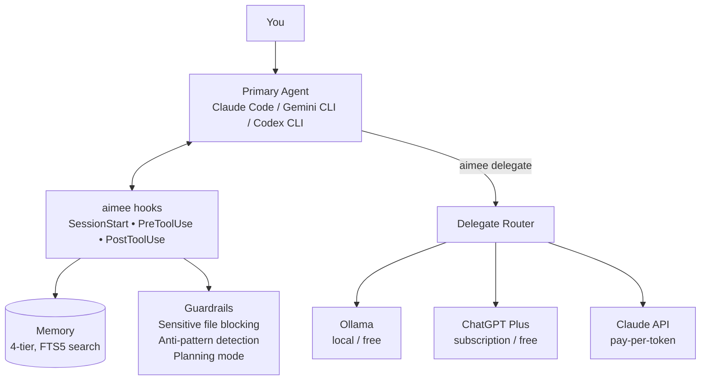

# aimee

**Give your AI coding tool a memory.** aimee adds persistent memory, safety guardrails, and cost-saving delegation to Claude Code, Gemini CLI, Codex CLI, and GitHub Copilot. One install, and every session starts knowing what the last one learned.

Single binary. Single SQLite database. Zero cloud dependencies. Written in C. Starts in under 10ms.

## The problem

Every AI coding session starts from scratch. Your AI tool doesn't remember your infrastructure, your preferences, your past mistakes, or even what it did five minutes ago in a different session. You spend tokens re-explaining context, re-discovering your codebase, and correcting the same errors over and over.

Meanwhile, there's nothing stopping it from overwriting your `.env`, editing production configs, or clobbering another session's work.

## What aimee does

aimee sits between you and your AI tool, intercepting every action through hooks. It requires zero changes to your workflow -- just run `aimee` instead of your tool directly.



### Memory that compounds over time

A 4-tier memory system tracks project context, infrastructure details, preferences, and past outcomes. Facts are deduplicated, contradictions are detected, and stale information decays automatically. Your AI starts every session already knowing what matters -- no re-discovery, no repeated questions.

```bash
aimee memory store db-host "PostgreSQL at 10.0.0.5:5432" --tier L2 --kind fact
aimee memory search "database"
aimee + "Always run tests before committing"   # becomes a persistent rule
```

### Guardrails that prevent costly mistakes

Before every file edit, aimee classifies the target. Sensitive files (`.env`, credentials, private keys) are blocked before the AI touches them. Known anti-patterns from past failures trigger warnings. Planning mode locks all writes until you're ready to implement.

### Delegation that cuts your bill

Route summarization, formatting, code review, and boilerplate to cheaper models. The primary agent receives a compact result instead of processing raw content. Local models via Ollama cost nothing. ChatGPT Plus subscriptions cost nothing extra. The router automatically picks the cheapest delegate that can handle the job.

```bash
aimee agent setup codex-oauth              # zero marginal cost via subscription
aimee delegate review "Review this PR"     # routes to cheapest capable delegate
aimee delegate code --tools "Add tests"    # delegate with file read/write access
```

### Session isolation that just works

Each session gets its own git worktree, state file, and branch. Run two sessions in parallel and they never clobber each other's work. Delegate agents inherit the same isolation.

### Works with what you already use

| Tool | Integration | Setup |
|------|------------|-------|
| Claude Code | Full hook support + MCP | `aimee setup` |
| Gemini CLI | Full hook support | `aimee setup` |
| Codex CLI | Full hook support + MCP + local plugin | `aimee setup` |
| GitHub Copilot | MCP server | `aimee setup` |

Switch tools any time. aimee keeps all your memory and context.

## Performance

aimee is designed to be invisible. Hook checks happen in the critical path between the AI and every file edit, so they have to be fast.

| Operation | p50 | p99 |
|-----------|-----|-----|
| Hook pre-tool check | 1ms | 19ms |
| Session startup | 8ms | 13ms |
| Memory search (FTS5) | 7ms | 18ms |

## How it saves tokens

| Mechanism | What it eliminates | Impact |
|-----------|--------------------|--------|
| Memory injection | "What database do you use?" and similar re-discovery | Hundreds of tokens per session |
| Code index (`find_symbol`) | Exploratory grep/find/read chains | Dozens of tool calls per lookup |
| Project descriptions | First-turn repo orientation | Thousands of tokens |
| Persistent rules | Repeated corrections | Entire wrong approaches avoided |
| Delegation | Primary agent processing routine content | Full task cost moved to free/cheap models |
| Anti-pattern warnings | Known-bad paths the AI would otherwise explore | Variable, prevents dead ends |

## Install

### Prerequisites

| Package | Debian/Ubuntu | macOS |
|---------|---------------|-------|
| C compiler | `apt install build-essential` | Xcode CLT |
| SQLite3 (with FTS5) | `apt install libsqlite3-dev` | System SQLite |
| libcurl | `apt install libcurl4-openssl-dev` | `brew install curl` |

### One-line install

```bash
git clone https://github.com/JBailes/aimee.git
cd aimee
./install.sh
```

Builds from source, installs to `/usr/local/bin/`, creates the database, and configures hooks for every detected AI coding tool. Also auto-registers the MCP server for tools that support it.

### Verify

```bash
aimee version
aimee memory stats
```

## Quick start

```bash
# Launch a session (starts your primary agent with aimee hooks active)
aimee

# Store a fact the AI will remember across sessions
aimee memory store myhost "PVE at 10.0.0.1" --tier L2 --kind fact

# Search memory
aimee memory search "proxmox"

# Give feedback (becomes a persistent rule injected into every session)
aimee + "Always check for merge conflicts before pushing"

# Set up a delegate agent for cost savings
aimee agent setup codex-oauth

# Delegate routine work to a cheaper model
aimee delegate review "Review this PR for security issues"

# Block file writes while planning
aimee plan

# Resume normal execution
aimee implement
```

## Documentation

| Document | Description |
|----------|-------------|
| [Command Reference](docs/COMMANDS.md) | Full list of commands, flags, and options |
| [Setting Up Delegates](docs/DELEGATES.md) | Configure delegate agents for task offloading |
| [Workspace Management](docs/WORKSPACES.md) | Multi-repo workspaces and session isolation |
| [Technical Reference](src/README.md) | Architecture, memory internals, database schema, build instructions |
| [Security Model](docs/SECURITY.md) | Threat model, trust boundaries, capability system |
| [Benchmarks](docs/BENCHMARKS.md) | Latency measurements and performance budget |
| [Compatibility](docs/COMPATIBILITY.md) | Supported OS, shell, and provider matrix |
| [Feature Status](docs/STATUS.md) | Implementation status of all features |
