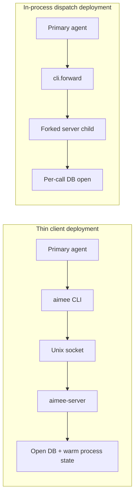

# Performance Benchmarks

## Overview

This document captures the current benchmark baseline for aimee’s latency-sensitive paths. The focus is the work that sits directly between a primary agent and useful execution: hook checks, memory access, session initialization, and delegate routing data.

Two deployment modes are benchmarked:

- **Thin client**: the `aimee` CLI talks to `aimee-server` over a Unix socket.
- **In-process dispatch**: commands run through `cli.forward` in forked server children.

Both modes are viable, but they optimize for different tradeoffs. The thin client benefits from a long-lived server process with an already-open database and warm state. The in-process path avoids the socket boundary and shows tighter latency distribution, but pays more per-call setup cost.



## Methodology

Benchmarks are run with `benchmarks/run.sh` and measure wall-clock latency using `date +%s%N`. Each operation is executed `N` times, and the benchmark reports p50, p95, and p99 latency in milliseconds.

The benchmark suite covers the critical paths that most directly affect responsiveness:

- hook latency
- memory search
- session startup
- delegate routing data loading
- maintenance work on memory state

Example invocation:

```bash
cd aimee

# Through aimee-server (default)
AIMEE=aimee ./benchmarks/run.sh 100
```

Benchmark environment:

- **Platform:** Proxmox VE 8.x, Debian 13, Intel Xeon, 32GB RAM, NVMe SSD
- **Database contents:** ~30 memories, 39 network hosts, 15 workspace projects
- **Baseline date:** 2026-04-02

## Results

### Thin client

This is the default deployment model. The CLI connects to `aimee-server` over a Unix socket. First-call latency includes socket connection overhead, while subsequent calls can reuse the connection and benefit from a warm server-side database handle.

| Operation | p50 | p95 | p99 | Notes |
|-----------|-----|-----|-----|-------|
| Startup (version) | <1ms | 1ms | 5ms | Binary load + socket connect |
| Hook pre (Edit) | 1ms | 3ms | 19ms | Critical path: guardrail check |
| Hook pre (Bash) | 1ms | 2ms | 18ms | Critical path: guardrail check |
| Memory search (FTS5) | 7ms | 8ms | 18ms | Full-text search on memories table |
| Memory list (L2 facts) | 1ms | 2ms | 4ms | Filtered query on memories table |
| Agent network | 7ms | 8ms | 9ms | Load and format agents.json |
| Session-start | 8ms | 9ms | 13ms | Context assembly (rules + facts + network) |
| Memory maintain | 11ms | 15ms | 17ms | Promotion/demotion/expiry cycle |

#### Analysis

The thin client mode produces very low median latency for operations that benefit from a resident server process. Startup and hook checks are especially fast at p50, which is consistent with pushing the expensive initialization work into `aimee-server` and keeping shared state warm.

The main cost of this architecture appears in tail latency rather than median latency. Hook checks show p99 values of 18–19ms despite 1ms p50, which indicates that the socket boundary and connection behavior occasionally dominate the critical path. This is not a throughput problem; it is a predictability problem at the tail.

Memory and session operations remain comfortably bounded. `Memory search (FTS5)` at 18ms p99 and `Session-start` at 13ms p99 suggest that the persistent process model is already doing what it should: keeping database-backed and context-assembly work interactive without forcing a full initialization cycle on every call.

### In-process dispatch

In this mode, commands are dispatched through `cli.forward` in forked server children. This avoids the external client/server socket hop, but the database is opened per call.

| Operation | p50 | p95 | p99 | Notes |
|-----------|-----|-----|-----|-------|
| Startup (version) | 2ms | 4ms | 4ms | Binary load + arg parse |
| Hook pre (Edit) | 4ms | 4ms | 6ms | Critical path: guardrail check |
| Hook pre (Bash) | 3ms | 4ms | 5ms | Critical path: guardrail check |
| Memory search (FTS5) | 10ms | 11ms | 12ms | Full-text search on memories table |
| Memory list (L2 facts) | 3ms | 3ms | 4ms | Filtered query on memories table |
| Agent network | 2ms | 3ms | 3ms | Load and format agents.json |
| Session-start | 3ms | 4ms | 4ms | Context assembly (rules + facts + network) |
| Memory maintain | 5ms | 6ms | 7ms | Promotion/demotion/expiry cycle |

#### Analysis

The in-process path is defined more by consistency than by absolute minimum p50 latency. Hook checks, memory access, and session-start all have narrow p50-to-p99 ranges, which means the system behaves more predictably from call to call.

That tighter spread is the main result here. Startup is slower at p50 than the thin client (`2ms` versus `<1ms`), and memory search is also slower at median (`10ms` versus `7ms`), which matches the expected cost of reopening the database on each call. But the tail remains much tighter: for example, `Memory search (FTS5)` reaches only `12ms` at p99, and hook checks stay between `5ms` and `6ms` at p99.

This mode is therefore attractive when predictable latency matters more than minimizing the best-case fast path. It trades a little median performance for substantially less variance.

## Performance Budget

The following budgets define acceptable p99 latency for the key interactive paths:

| Path | Target | Rationale |
|------|--------|-----------|
| Hook pre-tool check | <10ms p99 | Blocks between primary agent and file edit |
| Session-start | <100ms p99 | Runs once at primary agent session start |
| Memory search | <20ms p99 | Interactive query from primary agent or delegate |
| Agent network | <10ms p99 | Delegate agent config file read |

Current results against budget:

- **Hook pre-tool check:** in-process passes comfortably; thin client exceeds the `<10ms p99` target in both measured hook cases (`18ms` and `19ms`).
- **Session-start:** both modes pass with substantial margin (`13ms` thin client, `4ms` in-process).
- **Memory search:** both modes pass (`18ms` thin client, `12ms` in-process).
- **Agent network:** both modes pass (`9ms` thin client, `3ms` in-process).

The current performance story is therefore not that the system is broadly slow. It is that one specific user-facing path, thin-client hook enforcement, has measurable tail-latency headroom to recover.

## Scaling Notes

- `Memory search` is `O(n)` on the memories table via FTS5 `MATCH`. At the current scale of ~30 memories, this is effectively negligible. At 10,000+ memories, FTS5 indexing should preserve sub-linear query behavior in practice, but benchmark baselines should be regenerated at that scale rather than inferred.
- `Session-start` context assembly scales with the number of rules, facts, and network hosts included in injected context. The current assembly fits in a 32KB buffer. Delegate agent context assembly uses a separate 16KB budget.
- `Hook pre-tool check` is `O(1)` for path classification and `O(worktrees)` for worktree matching. As worktree count grows, this remains a likely source of incremental latency pressure even before database-backed paths become significant.
- Worktree creation is deferred until first write access, so `Session-start` does not include git operations.

A practical reading of the current data:

- Database-backed operations are already well within budget at the current dataset size.
- Tail behavior is more sensitive to deployment architecture than median behavior.
- If the system scales up in memories, hosts, or worktrees, the first regressions to watch are likely to be hook tail latency and context assembly size rather than average-case search latency.

## Running Benchmarks

Run the benchmark suite from the repository root:

```bash
cd aimee

# Through aimee-server (default)
AIMEE=aimee ./benchmarks/run.sh 100
```

Use the benchmark output to compare p99 latency against the performance budget. In CI or local regression checks, the key question is whether each critical path remains below its budget threshold, not whether every percentile exactly matches this baseline.
