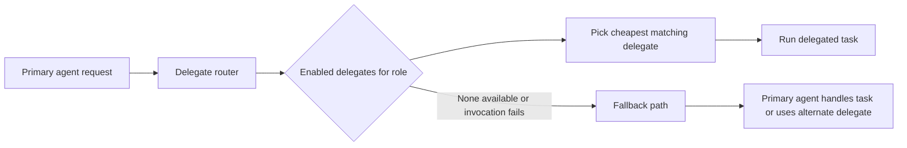
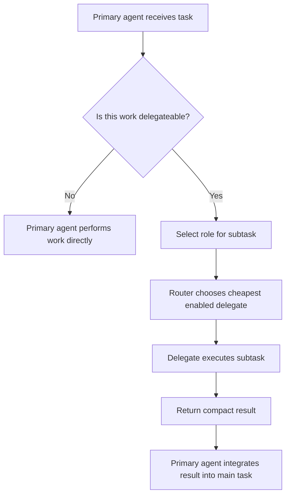

# Delegate Agents

## Quick Start

Use these commands to get delegation working quickly:

```bash
# 1) Configure a delegate provider
# Choose one setup command, for example:
aimee agent setup codex-oauth

# 2) Inspect the registered delegates and their routing data
cat ~/.config/aimee/agents.json

# 3) Use aimee normally; the primary agent will route delegateable work automatically
# See the Usage section below for realistic delegation scenarios.
```

`aimee` supports two kinds of agent:

- **Primary agent**: the AI coding tool you interact with directly, such as Claude Code, Gemini CLI, or Codex CLI
- **Delegate agents**: sub-agents used for offloaded work

The primary agent does not need delegate configuration. It integrates with `aimee` through hooks that inject memory, enforce guardrails, and manage session isolation. Delegate agents are optional and are configured separately.

## How It Works

Delegation exists so the primary agent can spend its attention on work that actually requires its strongest reasoning. Lower-cost or local delegate agents can handle routine work such as summarization, formatting, boilerplate generation, simple code review, and file transformations.

This reduces cost and keeps the primary agent focused on complex tasks.

Delegation saves primary-agent tokens in several ways:

- **Direct offloading**: when the primary agent delegates a summarization task, the full prompt and completion cost moves to the delegate. If that delegate is tier-0, the marginal cost is effectively zero.
- **Smaller context budget**: delegate agents receive a 16KB context budget, compared with 32KB for the primary agent, so each delegated call carries less background context.
- **Parallel execution**: multiple delegated tasks can run at the same time. The primary agent receives compact results instead of individually processing each input.
- **Automatic cheapest-model routing**: the router selects the cheapest enabled delegate that can satisfy the requested role.

For broader token-saving mechanisms beyond delegation, including memory injection, code index usage, project descriptions, and anti-pattern detection, see the [root README](../README.md#how-aimee-saves-tokens).

### Routing flow



### Primary agent delegation flow



## Setup

### Interactive setup

Use one of the setup commands below to register a delegate in `~/.config/aimee/agents.json`.

```bash
# Subscription-based (zero marginal cost)
aimee agent setup codex-oauth    # ChatGPT Plus/Pro/Enterprise (OAuth device flow)
aimee agent setup gemini-oauth   # Google One AI Premium (OAuth device flow)

# API key based (pay per use)
aimee agent setup codex          # OpenAI API
aimee agent setup claude         # Anthropic API
aimee agent setup gemini         # Google AI Studio
aimee agent setup copilot        # GitHub Copilot

# Any OpenAI-compatible endpoint
aimee agent setup openai         # Interactive wizard (Groq, Together, Fireworks, etc.)

# Local models (free, works offline)
./add-local-delegate.sh          # Auto-detects Ollama, recommends a model, registers it
```

Each setup command records the delegate's:

- endpoint
- authentication
- model
- roles
- cost tier

in `~/.config/aimee/agents.json`.

## Roles and Tiers

Every delegate agent is assigned one or more **roles** describing the kinds of tasks it can handle.

| Role | Description | Example use |
|------|-------------|-------------|
| `code` | Write or edit code | Implementation tasks |
| `review` | Analyze code or plans | Code review, anti-pattern extraction |
| `explain` | Explain concepts | Documentation, teaching |
| `refactor` | Restructure code | Cleanup, optimization |
| `draft` | Generate content | Test plans, commit messages |
| `execute` | Run agentic tasks | Multi-turn tool-use loops |
| `summarize` | Compress text | Session fold, window compaction |
| `format` | Reformat data | Context assembly when budget is tight |
| `search` | Find information | Documentation lookup |
| `reason` | Complex reasoning | Higher-difficulty analysis |

Delegates are also assigned a **cost tier**. Routing prefers the lowest-cost enabled delegate that matches the requested role.

| Tier | Meaning | Typical examples |
|------|---------|------------------|
| `0` | Free or subscription-backed | Local Ollama, Codex OAuth, Gemini OAuth |
| `1` | Low-cost API | Cheap hosted models |
| `2` | Mid-cost API | Stronger general-purpose models |
| `3` | Expensive API | Premium reasoning-capable models |

This tiering allows `aimee` to send lightweight work to inexpensive models while still allowing stronger delegates for more demanding roles.

## Routing

The router evaluates delegates using three main pieces of information:

1. **Role match**: the delegate must support the requested role.
2. **Enabled state**: only enabled delegates are considered.
3. **Cost tier**: the cheapest enabled matching delegate is selected.

In practice, tasks such as `summarize`, `format`, and `draft` usually route to tier-0 delegates first. This means the primary agent often pays only for issuing the delegation request and reading the returned summary or result.

If no suitable delegate is available, or if the delegate invocation fails, the system falls back rather than blocking the main task.

## Usage

### When delegation helps

Delegation is most useful when the primary agent would otherwise spend expensive tokens on work that does not require top-tier reasoning.

Common examples:

- summarizing long logs before the main agent decides what matters
- reformatting generated data into a compact structure
- drafting commit messages or test plans
- reviewing multiple files in parallel for obvious issues
- doing simple transformations across a large set of files

### Realistic scenarios

#### Scenario: summarize several large outputs before planning a fix

You are investigating a failing build with multiple long log files. Instead of reading every log in full with the primary agent, delegate `summarize` work for each log, then let the primary agent compare the summaries and choose a remediation strategy.

This reduces primary-agent context usage and lets summaries run in parallel.

#### Scenario: use a local model to draft repetitive artifacts

You need a first pass at release notes, commit messages, and a test checklist after a refactor. A tier-0 local or subscription-backed `draft` delegate can generate those artifacts cheaply, and the primary agent can review and refine only the final output.

#### Scenario: parallel review of touched files

A change touches ten source files. Rather than having the primary agent inspect them sequentially, delegate `review` tasks across the files to collect likely issues, suspicious patterns, or missing tests. The primary agent then synthesizes the results and decides what to fix.

#### Scenario: context compaction during a long session

During a long coding session, use a `summarize` delegate to fold older context into a compact working summary. The primary agent keeps the essential facts without carrying the entire previous transcript.

### Practical usage notes

- Prefer tier-0 delegates for routine roles like `summarize`, `format`, and `draft`.
- Reserve higher-tier delegates for roles such as `reason` when the task genuinely benefits from stronger reasoning.
- Assign multiple roles to a delegate only when the model is actually suitable for those tasks.
- Keep at least one low-cost delegate enabled to maximize the benefit of automatic routing.

## Configuration Reference

Delegates are stored in:

```text
~/.config/aimee/agents.json
```

The configuration contains each delegate's:

- provider type
- endpoint
- authentication
- model
- roles
- cost tier
- enabled state

### Provider types

The supported provider types are:

- `codex-oauth`
- `gemini-oauth`
- `codex`
- `claude`
- `gemini`
- `copilot`
- `openai`
- local delegates registered through `./add-local-delegate.sh`

### Config format

The exact file content depends on the providers you register, but each delegate entry includes the same core routing and connection data: endpoint, auth, model, roles, and tier.

A representative shape looks like this:

```json
{
  "agents": [
    {
      "name": "local-summarizer",
      "provider": "openai",
      "endpoint": "http://localhost:11434/v1",
      "model": "qwen2.5-coder:7b",
      "roles": ["summarize", "draft", "format"],
      "tier": 0,
      "enabled": true,
      "auth": {
        "type": "none"
      }
    },
    {
      "name": "premium-review",
      "provider": "claude",
      "endpoint": "https://api.anthropic.com",
      "model": "claude-sonnet",
      "roles": ["review", "reason", "explain"],
      "tier": 2,
      "enabled": true,
      "auth": {
        "type": "api_key"
      }
    }
  ]
}
```

The important routing fields are:

- `provider`
- `endpoint`
- `model`
- `roles`
- `tier`
- `enabled`
- `auth`

If you register delegates through the interactive setup commands, `aimee` writes this file for you.

## Cross-Verification

To verify a delegate setup, check both configuration and behavior.

### 1. Confirm the config file exists and contains the expected delegates

```bash
cat ~/.config/aimee/agents.json
```

Verify that:

- the delegate is present
- the expected roles are assigned
- `enabled` is set correctly
- the tier matches the intended routing priority
- endpoint and authentication values are correct

### 2. Confirm role coverage

Make sure the roles you expect to delegate are actually represented in the configured delegates. A low-cost delegate with `summarize`, `draft`, and `format` is usually the most immediately useful baseline.

### 3. Confirm routing intent

Review the configured tiers and ensure the cheapest appropriate delegate will be selected for each role. For example, if both a local summarizer and a premium reasoning model support `summarize`, the local summarizer should have the lower tier.

### 4. Confirm fallback expectations

If a delegate is disabled or unavailable, the system should still allow work to continue through fallback handling. Verify that your setup does not depend on a single fragile delegate for all roles.
