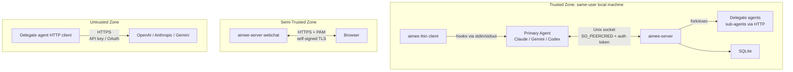
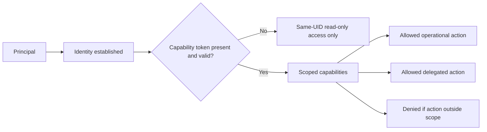
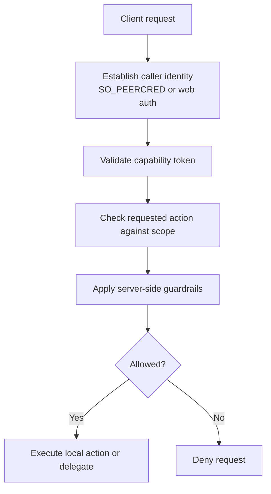

# Security Model

## Overview

This document describes the security model for `aimee`, including its trust boundaries, principals, attack surfaces, capability model, enforcement path, token handling, and known non-goals.

The system is designed primarily for same-user, local-machine operation. Its strongest protections apply to local clients connecting to the local `aimee-server` over a Unix domain socket, where the server can validate the caller's operating-system identity with `SO_PEERCRED`.

The model distinguishes clearly between what is protected and what is not:

- Protected:
  - Separation between same-UID and different-UID local processes on the host
  - Separation between authenticated and unauthenticated clients
  - Restriction of delegated operations to explicitly granted capabilities
  - Mediation of sensitive operations through server-side guardrails
- Not fully protected:
  - Compromise by processes already running as the same local user
  - Full confidentiality or integrity of content sent to external delegate providers
  - Browser access as a hardened Internet-facing security boundary
  - Administrative isolation equivalent to a multi-tenant remote service

## Trust Boundaries

Boundary summary:

- Trusted zone:
  - Local same-user components on the same machine
  - Trust is based largely on OS-level same-UID identity and local process assumptions
- Semi-trusted zone:
  - Browser-facing webchat path protected by HTTPS and PAM
  - Useful for authenticated operation, but not treated as equivalent to the local Unix-socket boundary
- Untrusted zone:
  - External model providers and any network path used to reach them
  - Requests may be authenticated, but remote systems are outside the local trust domain

## Principals

| Principal | Identity | Trust Level |
|-----------|----------|-------------|
| Local user | `SO_PEERCRED` UID match | Full (same-user) |
| Authenticated client | Capability token | Operational (no admin) |
| Unauthenticated same-UID | `SO_PEERCRED` only | Read-only |
| Different-UID local process | Different OS identity | Untrusted |
| Browser user | PAM-authenticated session | Semi-trusted |
| External delegate provider | API key or OAuth to remote service | Untrusted |

Principal distinctions:

- Local user:
  - A process connecting over the Unix socket with a matching UID is the most trusted operational principal in the system.
- Authenticated client:
  - A holder of a valid capability token can perform only the actions explicitly granted by that token.
  - This principal is operational, not administrative.
- Unauthenticated same-UID:
  - Same-user identity alone may permit limited read-only behavior, but does not imply full access.
- Different-UID local process:
  - A different local OS user is not trusted merely for being on the same machine.
- Browser user:
  - PAM-backed browser access is authenticated, but the browser path is treated as less trusted than the Unix-socket path.
- External delegate provider:
  - External AI providers are required for some delegated operations but are outside the trusted computing base.

## Attack Surfaces

The primary attack surfaces are:

1. Unix socket interface
   - Local IPC endpoint to `aimee-server`
   - Protected primarily by filesystem permissions, local host access, and `SO_PEERCRED`
   - Main concern: unauthorized local access, confused-deputy behavior, or misuse by same-user processes

2. Capability tokens
   - Used to authorize operational actions
   - Main concern: token theft, overbroad grants, replay within the valid lifetime, or incorrect scope enforcement

3. Browser webchat
   - HTTPS endpoint with PAM-backed authentication and self-signed TLS
   - Main concern: session misuse, local browser trust assumptions, and weaker guarantees than the Unix-socket channel

4. Delegate execution path
   - Server fork/exec of delegate agents and sub-agent orchestration
   - Main concern: privilege misuse, unsafe parameter forwarding, or unintended expansion of allowed actions

5. Delegate HTTP client to external providers
   - Outbound HTTPS to OpenAI, Anthropic, Gemini, or similar providers using API keys or OAuth
   - Main concern: disclosure of prompts, metadata, or outputs to third parties; dependency on remote provider security and policy

6. SQLite-backed local state
   - Local persistence used by the server
   - Main concern: tampering by same-user processes, accidental over-retention, or unauthorized reads on a compromised host account

These protections are scoped narrowly. The system is designed to resist different-UID local misuse better than same-UID local compromise. If an attacker already controls the same local user account, many protections reduce to best-effort mediation rather than strong isolation.

## Capability Model

Capabilities are the core authorization mechanism for operational actions. A client may identify as the same local user, but access to non-read-only actions still depends on possession of a valid capability token and successful guardrail checks.

Capability properties preserved by this model:

- Capabilities grant operations explicitly, not implicitly.
- Holding a token does not make a client administrative.
- Same-user identity and token possession are distinct signals.
- Read-only behavior may be available to unauthenticated same-UID callers, but broader actions require a token.
- Requests outside the token scope must be denied even if the caller is local and authenticated.

What the capability model protects:

- Accidental or unauthorized use of operational APIs without an explicit grant
- Lateral use of the server as a confused deputy for actions not covered by a token
- Expansion from authenticated status to unrestricted access

What it does not protect:

- Misuse by a same-user attacker who can steal or invoke a valid token
- Actions that are intentionally within the granted token scope
- Content confidentiality once data is intentionally sent to an external delegate provider

## Guardrail Enforcement

Sensitive operations are intended to be mediated server-side. The enforcement chain combines transport identity, token validation, and action-level checks before work is executed.

Enforcement expectations:

- Identity is established first.
- Capability validation happens before operational execution.
- Scope checks are performed before local actions or delegation.
- Guardrails are enforced on the server side, not delegated to clients.
- Denial is the expected outcome when identity, token state, or requested capability does not satisfy policy.

This model protects against clients claiming authority they do not have. It does not claim to protect against arbitrary actions by a fully compromised same-user environment.

## Token Lifecycle

Capability tokens are part of the active authorization boundary and should be understood as lifecycle-managed security artifacts.

Lifecycle stages:

1. Issuance
   - A token is created with explicit operational scope.
   - The token represents a bounded authorization grant, not blanket trust.

2. Presentation
   - The client presents the token when requesting protected actions.
   - Presence of a token supplements, but does not replace, transport or session identity.

3. Validation
   - The server verifies that the token is recognized, valid, and suitable for the requested operation.
   - Invalid, missing, or insufficiently scoped tokens must result in denial.

4. Use
   - Actions are limited to the token's granted capabilities.
   - Delegated work is still subject to server-side checks.

5. Expiry or revocation
   - A token should cease to authorize actions once expired or no longer accepted by the server.
   - Expired or revoked tokens must not continue to permit operational access.

Security implications:

- Token secrecy matters because possession enables the granted operations.
- Token scope matters because overbroad tokens enlarge the blast radius of theft or misuse.
- Server-side validation matters because local identity alone is insufficient for broader operations.

## Explicit Non-Goals

This security model does not aim to provide:

- Protection against a hostile process already running as the same local user with the ability to inspect local process state, files, or tokens
- Internet-hardened exposure for the browser interface comparable to a public SaaS perimeter
- End-to-end confidentiality from the local system to external AI providers once prompts or outputs are intentionally sent over delegate HTTP APIs
- Strong multi-tenant isolation between mutually untrusted users on the same host beyond the documented local-user and token boundaries
- Administrative privilege separation equivalent to a dedicated sandbox, VM, or MAC-enforced isolation layer

These non-goals are intentional design constraints, not omissions in this document.

## Audit History

This document reflects the current documented model and preserves the previously described security information, including:

- Trusted, semi-trusted, and untrusted zones
- The principal classes and their trust levels
- The Unix socket, browser, delegate, token, and SQLite attack surfaces
- Capability-scoped operational authorization
- Server-side guardrail enforcement before execution
- Token-based authorization as distinct from local transport identity

No separate historical audit record was present in the prior version of this file. This section therefore serves as the documented baseline for future audit updates.
