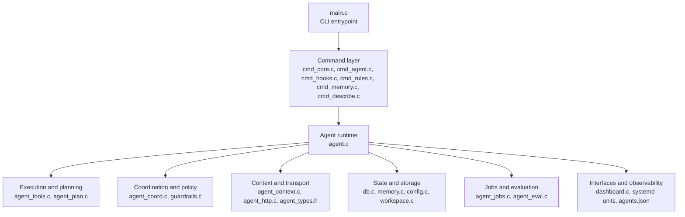

# Feature Status

This document tracks implemented features in the codebase. The corresponding
proposal documents live under `docs/proposals/done/`. Additional proposals may
still exist under `docs/proposals/pending/` and `docs/proposals/rejected/`, so
this file is a feature tracking reference rather than a complete roadmap.

## Core System

| Feature | Proposal | Status | Description | Key files |
|---------|----------|--------|-------------|-----------|
| Tool registry with JSON schema validation | platform-features | Done | Registers tools centrally and validates tool inputs against JSON schemas before execution. | agent.c, db.c |
| Plan IR (structured execution plans for delegates) | platform-features | Done | Represents delegate work as structured plans so execution can be reasoned about and inspected consistently. | agent_plan.c |
| Execution transactions (file checkpoints, rollback) | platform-features | Done | Protects file-editing operations with checkpoints and rollback support for safer execution. | agent_tools.c |
| Policy-as-code guardrails (primary + delegate agents) | platform-features | Done | Applies codified safety and workflow rules to both primary and delegated agent execution. | agent.c |
| Deterministic replay (delegate execution trace) | platform-features | Done | Records delegate execution traces so runs can be replayed and debugged deterministically. | agent.c |
| Eval harness with task suites | platform-features | Done | Provides a repeatable evaluation harness for running the agent against defined task suites. | agent_eval.c |
| Confidence calibration and abstention | platform-features | Done | Lets the agent estimate confidence and abstain when reliability is too low. | agent.c |
| Prometheus metrics (textfile collector) | platform-features | Done | Exposes operational metrics in Prometheus textfile format for external scraping. | agent.c |
| Repo contract (.aimee/project.yaml) | phase2 | Done | Loads per-project build, test, lint, and risk-path rules from a repository contract file. | agent.c |
| Environment introspection | phase2 | Done | Detects available tools, platform details, and execution environment capabilities at runtime. | agent.c |
| Change manifests | phase2 | Done | Produces structured records of changes made during an execution session. | agent.c |
| Hard/soft/session directives | phase2 | Done | Supports multiple directive scopes so durable rules and per-session guidance can coexist. | agent_coord.c, cmd_rules.c |
| Two-phase plan mode (--plan) | follow-up | Done | Supports planning-first execution with an explicit plan mode before acting. | agent_plan.c |
| ChatGPT backend endpoint (delegate provider) | follow-up | Done | Integrates a ChatGPT-backed provider for delegate agent execution. | cmd_agent.c, agent_context.c, agent.c |
| Model fallback (delegate: gpt-5.4 -> gpt-5.4-mini) | follow-up | Done | Falls back to a secondary model when the preferred delegate model is unavailable. | agent_context.c, agent.c |
| Extra HTTP headers (ChatGPT-Account-ID) | follow-up | Done | Sends required account-scoped HTTP headers for backend requests. | agent_http.c, agent_types.h |
| JWT claim extraction (account_id) | follow-up | Done | Extracts account identity from JWT claims for downstream request handling. | cmd_agent.c |
| Workspace manifest (YAML) | launch-command | Done | Stores workspace configuration in YAML for discovery and management commands. | workspace.c |
| No-subcommand launch (exec primary agent) | launch-command | Done | Allows the default CLI entrypoint to launch the primary agent directly without an extra subcommand. | main.c |
| Setup/quickstart provisioning | launch-command | Done | Provides setup flows to provision the local environment for first use. | cmd_core.c |
| Workspace add/remove | launch-command | Done | Adds and removes repositories from the managed workspace set. | cmd_core.c |
| Bootstrap script (setup.sh) | launch-command | Done | Includes a bootstrap script for initial environment and dependency setup. | setup.sh |
| Webchat systemd service (enable/disable) | - | Done | Manages the webchat service lifecycle through systemd integration commands. | cmd_core.c, systemd/aimee-webchat.service |
| Network inventory (`agent network`) | - | Done | Exposes configured network host inventory through a dedicated CLI command. | cmd_agent.c, agents.json |

## Memory System

| Feature | Proposal | Status | Description | Key files |
|---------|----------|--------|-------------|-----------|
| Artifact-aware memory (linking, staleness) | platform-features | Done | Associates memories with artifacts and tracks when recalled information may be stale. | cmd_memory.c, memory.c |
| Workspace-scoped memory recall | workspace-scoped-memory | Done | Restricts memory recall to the active workspace so unrelated repositories do not pollute context. | cmd_hooks.c |
| Memory FTS5 full-text search | - | Done | Adds full-text indexing so stored memories can be searched efficiently by content. | db.c (migration 28), memory.c |

## Delegate Agent System

| Feature | Proposal | Status | Description | Key files |
|---------|----------|--------|-------------|-----------|
| Delegate agent tool-use loop | executable-agents | Done | Runs delegated agents through a full tool-using execution loop rather than a single response pass. | agent.c |
| Delegate tool execution (bash, read, write, list, verify, git_log) | executable-agents | Done | Exposes the core execution toolset needed for delegated agents to inspect and modify repositories. | agent_tools.c |
| Ephemeral SSH (delegate agents) | executable-agents | Done | Provides short-lived SSH material to delegates so remote access stays scoped to the task. | agent.c |
| Context injection (primary agent via hooks, delegate agents via agent_context) | executable-agents | Done | Injects execution context differently for primary and delegated agents while preserving the same working model. | agent.c, cmd_hooks.c |
| Multi-delegate coordination (planner/critic/worker) | platform-features | Done | Coordinates multiple delegate roles so planning, critique, and implementation can be split across agents. | agent_coord.c |
| Quorum voting (across delegate agents) | platform-features | Done | Compares outputs from multiple delegates and resolves decisions through quorum-based agreement. | agent_coord.c |
| Durable delegate jobs (create, heartbeat, resume) | phase2 | Done | Persists delegate job state so work can survive interruptions and be resumed later. | agent_jobs.c |
| Per-turn heartbeat updates (delegate agents) | follow-up | Done | Emits heartbeat updates during delegate execution so long-running work remains observable. | agent.c, agent_jobs.c |
| Project descriptions (via delegate agent) | project-describe | Done | Uses a delegate agent to generate or refresh project descriptions from repository context. | cmd_describe.c, workspace.c |

## Session Isolation

| Feature | Proposal | Status | Description | Key files |
|---------|----------|--------|-------------|-----------|
| Per-session state files | session-isolation | Done | Stores transient session state in isolated files rather than sharing one global state blob. | config.c, cmd_hooks.c |
| Git worktree isolation (primary + delegate agents) | session-isolation | Done | Separates primary and delegated work into isolated git worktrees to reduce interference and conflicts. | cmd_hooks.c, guardrails.c |
| Session-scoped DB columns | session-isolation | Done | Tags database-backed state with session identifiers so concurrent sessions stay isolated. | db.c |
| Worktree path enforcement | session-isolation | Done | Enforces path boundaries so agents only operate within their assigned worktree locations. | guardrails.c |
| Stale session pruning | session-isolation | Done | Cleans up expired session state and abandoned worktrees to keep the environment healthy. | cmd_hooks.c |

| Memory search includes facts | - | Done | Ensures memory search results include L2 facts alongside conversation windows. | cmd_memory.c, memory.c, server_state.c |
| Delegation pattern promotion | - | Done | Auto-promotes recurring delegation patterns from agent_log to L2 facts. | memory_promote.c |
| Richer delegation feedback | - | Done | Captures detailed feedback from delegate executions for pattern learning. | agent.c |
| Enhanced session-start context (primary agent) | - | Done | Expands session-start injection with project context, delegation history, and capabilities. | cmd_hooks.c |

## Code Intelligence

| Feature | Proposal | Status | Description | Key files |
|---------|----------|--------|-------------|-----------|
| C/C++ extractor | c-extractor | Done | Extracts C and C++ code structure for symbol-aware analysis and navigation. | extractors_extra.c |
| Lua extractor | lua-extractor | Done | Extracts Lua code structure for the same symbol-aware analysis pipeline. | extractors_extra.c |
| Extractor test suite | c-extractor, lua-extractor | Done | Verifies extractor behavior with automated tests covering supported language parsers. | tests/test_extractors.c |

## MCP and Integration

| Feature | Proposal | Status | Description | Key files |
|---------|----------|--------|-------------|-----------|
| MCP server (`aimee mcp-serve`) | - | Done | Stdio JSON-RPC 2.0 server exposing memory, index, and delegation tools to MCP-compatible primary agents. Built into the aimee client binary. | mcp_server.c, cli_mcp_serve.c |
| MCP auto-config (.mcp.json) | - | Done | Auto-generates MCP configuration for Claude Code and Codex CLI workspace integration. | cmd_core.c |
| Codex CLI local plugin | claude-code-plugin-mcp | Done | Registers aimee as a local Codex CLI plugin via marketplace, plugin cache, and config.toml. | install.sh, cmd_core.c |
| Binary split (server architecture) | binary-split | Done | Splits monolith into thin client and full server with layered static libraries. MCP is built into the client. | see Server Architecture |
| Makefile install target | - | Done | Provides `make install` for building and installing all binaries to /usr/local/bin/. | src/Makefile |
| Deferred worktree creation | - | Done | Defers git worktree creation until first write access, keeping session-start fast. | guardrails.c, cmd_hooks.c |
| Local observability dashboard | phase2 | Done | Embedded HTTP dashboard for viewing metrics, delegation history, and session state. | dashboard.c |

## Server Architecture

The monolith has been split into two binaries with layered static libraries. MCP support is built into the client.

| Binary | Libraries | External deps |
|--------|-----------|---------------|
| `aimee` | core + data (thin client + MCP serve) | sqlite3, pthread |
| `aimee-server` | core + data + agent + cmd | sqlite3, curl, ssl, pam |

| Library | Size | Contents |
|---------|------|----------|
| `libaimee-core.a` | 390KB | db, config, util, text, render, cJSON |
| `libaimee-data.a` | 953KB | memory, index, rules, tasks, guardrails, workspace |
| `libaimee-agent.a` | 744KB | delegate agent loop, tools, HTTP, policy, plan, eval |
| `libaimee-cmd.a` | 1.2MB | cmd_* handlers, webchat, dashboard |

## Refactoring

All planned structural refactoring is complete.

| Item | Status |
|------|--------|
| Command registry (command_t table) | Done |
| Agent.c decomposition (7 modules) | Done |
| Narrow agent headers (8 focused .h files) | Done |
| App context injection (app_ctx_t) | Done |
| DB stmt cache (FNV-1a hash keyed) | Done |
| Option parser (opt_parse) | Done |
| Global elimination (g_json_output etc.) | Done |
| Subcommand dispatch tables | Done |
| Migration registration cleanup | Done |
| agent_result_to_json() | Done |
| ctx_db_open/close helpers | Done |
| Session context builder extraction | Done |
| cmd_*.c module split | Done |
| Architecture comments on all .c files | Done |
| CLI integration tests | Done |
