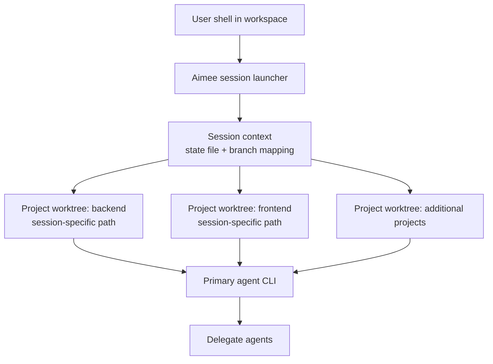

# Workspace Management

Aimee supports declarative multi-repository workspaces through an `aimee.workspace.yaml` manifest placed at the root of your workspace.

Workspaces let you describe:

- which repositories belong to the workspace
- which primary provider should be used for sessions in that workspace
- which system or custom dependencies are required

The workspace definition is then used to provision repositories and to create isolated per-session git worktrees so concurrent sessions do not interfere with each other.

## Workspace Manifest

Create an `aimee.workspace.yaml` file in your project root.

```yaml
name: my-workspace
provider: claude

projects:
  - name: backend
    repo: git@github.com:org/backend.git
    description: "REST API server (Go)"

  - name: frontend
    repo: git@github.com:org/frontend.git
    description: "React SPA"

dependencies:
  apt:
    - postgresql
  custom:
    - name: ".NET 9 SDK"
      check: "dotnet --list-sdks | grep -q '^9\\.'"
      install: "curl -fsSL https://dot.net/v1/dotnet-install.sh | bash -s -- --channel 9.0"
```

## Manifest Format

The manifest is declarative. It defines the repositories and dependencies that make up a workspace.

### Top-level fields

#### `name`
A human-readable name for the workspace.

Use this to identify the workspace in tooling and logs.

#### `provider`
Selects the primary agent CLI used for sessions launched in this workspace.

For example, `provider: gemini` causes Aimee to launch Gemini CLI for this workspace instead of the globally configured default. This setting applies only to the primary agent for the workspace session.

#### `projects`
A list of repositories that belong to the workspace.

Each project entry defines one repository that Aimee should provision and manage as part of the workspace.

Each project supports the following fields:

- `name`: A short identifier for the project within the workspace.
- `repo`: The git repository URL to clone and manage.
- `description`: A short explanation of what the project contains or what role it serves.

#### `dependencies`
Defines dependencies needed across the workspace.

This can include package-manager dependencies and custom install logic.

### Dependency sections

#### `dependencies.apt`
A list of apt packages that should be installed during setup.

Example:

```yaml
dependencies:
  apt:
    - postgresql
```

#### `dependencies.custom`
A list of custom dependency definitions for tools that need explicit detection and installation logic.

Each custom dependency supports:

- `name`: Human-readable dependency name.
- `check`: A shell command used to detect whether the dependency is already available.
- `install`: A shell command used to install the dependency if the check fails.

Example:

```yaml
dependencies:
  custom:
    - name: ".NET 9 SDK"
      check: "dotnet --list-sdks | grep -q '^9\\.'"
      install: "curl -fsSL https://dot.net/v1/dotnet-install.sh | bash -s -- --channel 9.0"
```

## Commands

```bash
# Add a workspace
aimee workspace add --repo git@github.com:org/backend.git --language go --description "API server"

# Provision all workspaces (clone repos, install deps)
aimee setup
```

Aimee auto-detects languages by scanning file extensions and installs the required toolchain.

## Session Isolation

Each session gets its own git worktree for every project in the workspace, its own state file, and its own branch. Two concurrent sessions do not clobber each other.

This isolation applies to all session activity, including:

- file edits made by the primary agent
- delegate agent executions performed with `--tools`
- git operations carried out during the session

### Isolation model



### What happens when a session starts

When a session starts, Aimee:

1. Creates a per-session worktree for each workspace project.
2. Maps the user's current directory to the matching worktree path for that session.
3. Launches the primary agent CLI with hooks active inside the worktree.

Delegate agents invoked during the session inherit the same worktree paths, so their file operations remain within the session's isolated copy rather than touching the shared repository checkout.

## Worktree Lifecycle

A workspace session uses git worktrees as disposable, isolated working copies for each project.

### Creation

At session start, Aimee creates one worktree per project in the workspace. Each worktree is specific to the current session and is paired with session-local state and branch information.

This means different sessions can operate on the same repository at the same time without colliding in the same checkout.

### Usage

During the session, all repository operations are redirected into the session's worktree:

- the primary agent edits files in the worktree
- delegate agents inherit and use the same worktree paths
- hooks and git commands run against the worktree, not the shared base clone

Aimee also maps the directory the user started from into the corresponding project worktree so commands continue to behave as expected from the user's perspective.

### Cleanup

When the session ends, the per-session worktrees can be removed without affecting the underlying repository clones.

Because each session has its own isolated copy, cleanup is straightforward: session-specific worktrees, branches, and state can be discarded independently of any other active session.

## Provider Override

The `provider` field in the workspace manifest determines which primary agent CLI tool is used for sessions in that workspace.

This overrides the global configuration. For example, setting `provider: gemini` launches Gemini CLI instead of Claude Code for that workspace.

This setting affects only the primary agent. Delegate agents are configured separately in `~/.config/aimee/agents.json` and remain available across all workspaces.

## Delegate Agents Across Workspaces

Delegate agents are configured globally, not per workspace. A single `agents.json` file defines all available delegate agents, and any workspace can use them.

Memory and rules are also shared across workspaces, with workspace-scoped recall for project-specific facts. That means delegates can use the broader knowledge base regardless of which workspace they are invoked from, while still preserving workspace-specific context where appropriate.
