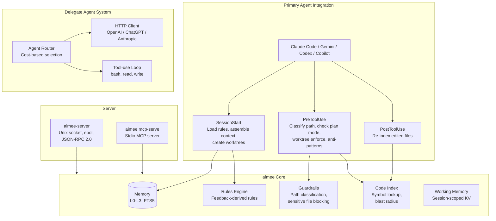
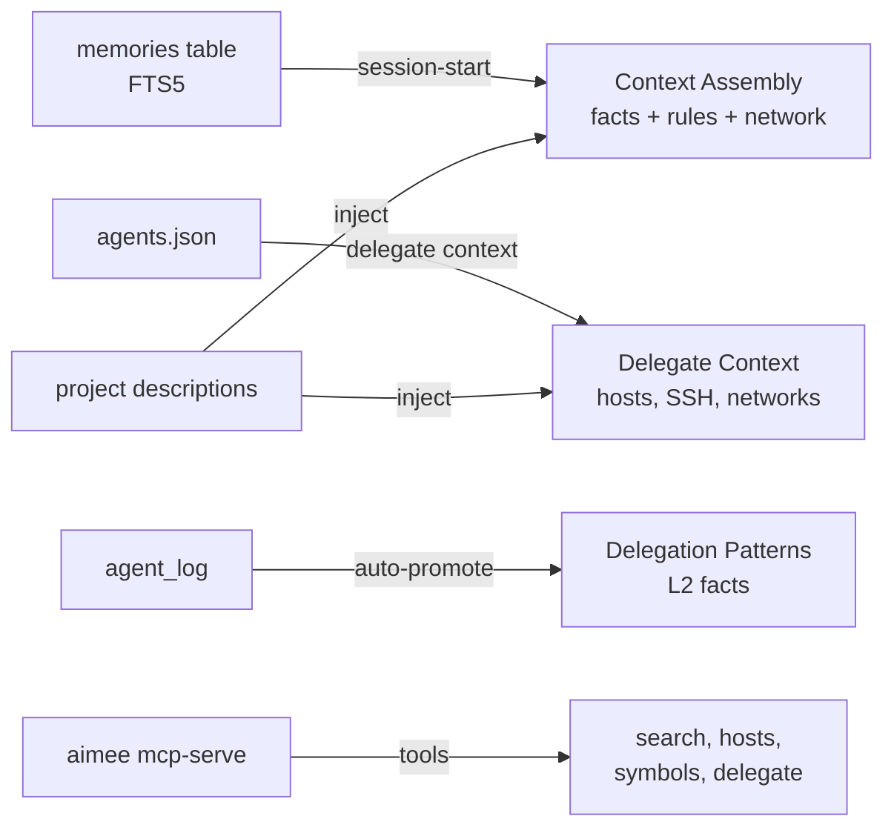
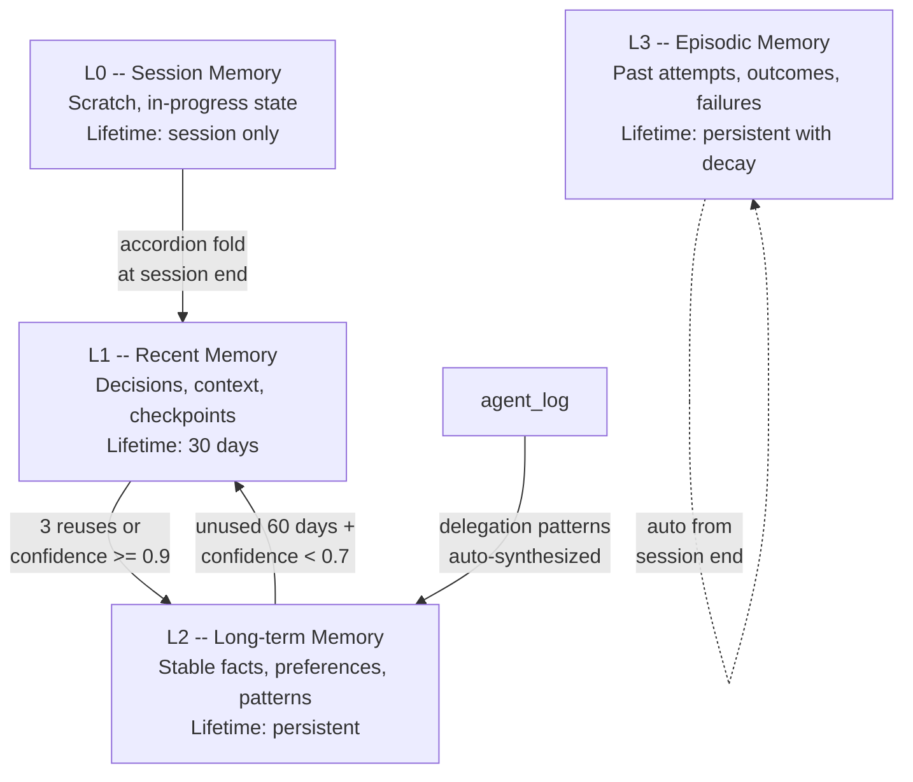
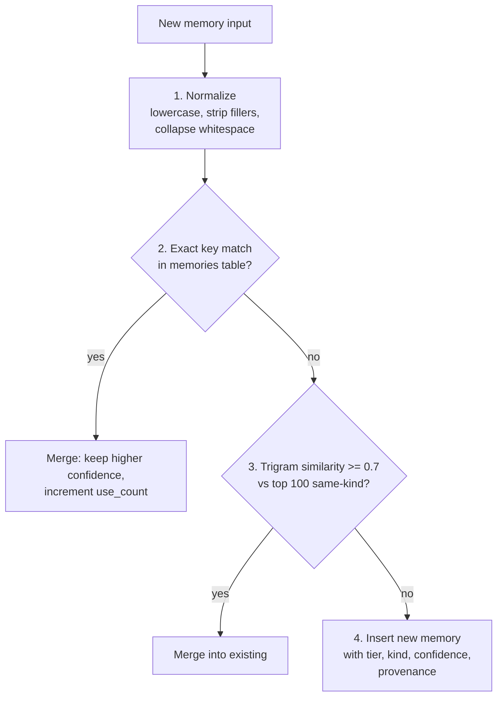
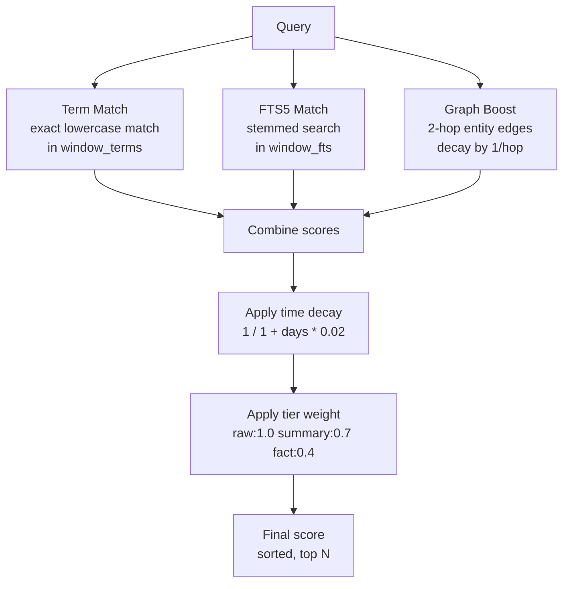
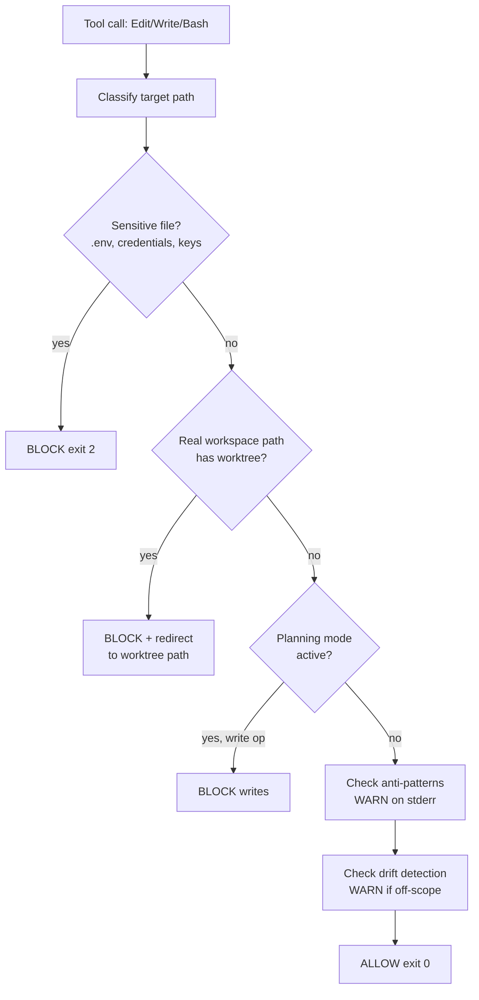
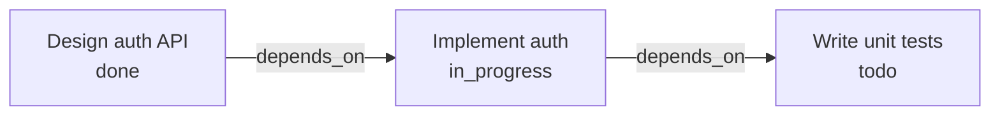
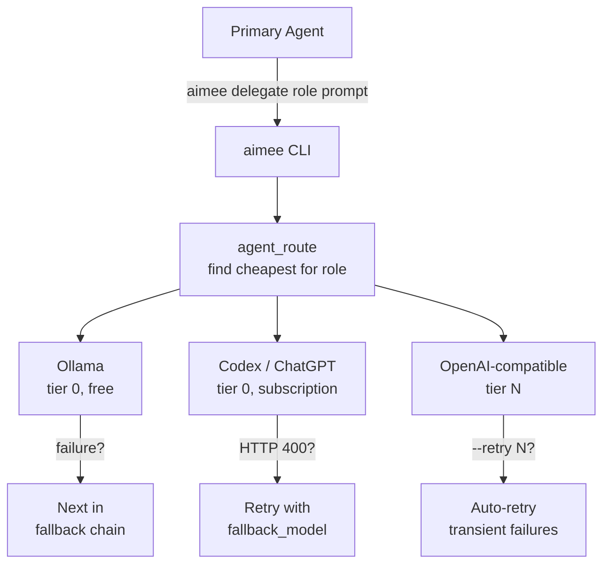
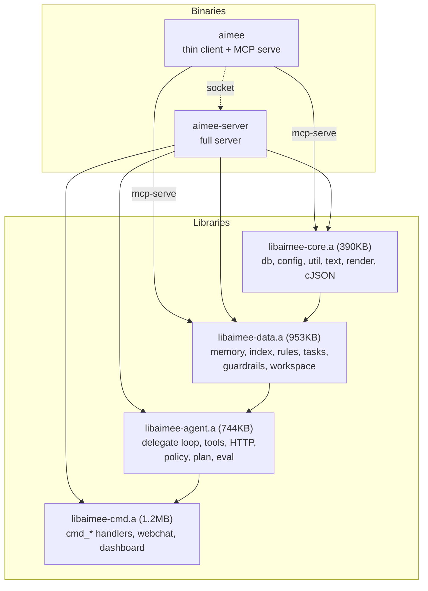

# aimee -- Technical Reference

Architecture, internals, and build instructions. For usage and getting started, see the [root README](../README.md).

aimee is written in C11 for performance and minimal footprint. ~30,000 lines across 55+ source files, compiled to two binaries (thin client and server) with no runtime dependencies beyond system-provided SQLite and libcurl. Startup is under 1ms (thin client). Every hook call completes in single-digit milliseconds. MCP support is built into the client via `aimee mcp-serve`.

## Architecture overview

aimee supports two agent roles. The **primary agent** is the AI coding tool the user interacts with (Claude Code, Gemini CLI, Codex CLI, GitHub Copilot). aimee integrates through hooks -- intercepting tool calls, injecting memory and rules, enforcing guardrails, and managing session isolation. **Delegate agents** are sub-agents configured in `agents.json` that handle offloaded work via `aimee delegate <role> <prompt>`.



### Knowledge flow



## Module map

### Core layer (`libaimee-core.a`)

| File | Responsibility |
|------|----------------|
| `db.c` | SQLite, 28 migrations, prepared statement cache (FNV-1a hash) |
| `config.c` | App config, `session_id()`, atomic writes |
| `util.c` | Core utilities, option parsing, security helpers |
| `text.c` | Text similarity, stemming, tokenization, search |
| `render.c` | JSON output, struct-to-JSON converters |
| `log.c` | Structured logging with level control |
| `platform_*.c` | Platform abstractions (events, IPC, random, process) |
| `client_integrations.c` | AI tool detection and hook registration |
| `mcp_git.c` | MCP git tool handlers for primary agents |
| `mcp_tools.c` | MCP tool definitions and dispatch |
| `git_verify.c` | Pipeline verification gate |
| `cJSON.c` | Vendored JSON parser |

### Data layer (`libaimee-data.a`)

| File | Responsibility |
|------|----------------|
| `memory.c` | 4-tier memory (L0-L3), CRUD, FTS5 search, quality gates |
| `memory_promote.c` | Promotion, demotion, expiry, conflict detection, delegation pattern synthesis |
| `memory_context.c` | Context assembly, cache, compaction |
| `memory_scan.c` | Conversation scanning, JSONL parsing |
| `memory_graph.c` | Entity-relationship graph |
| `memory_advanced.c` | Anti-patterns, style learning, compaction |
| `index.c` | Code indexing, symbol lookup |
| `extractors.c` | Source parsing, definition extraction (JS/TS/Python/Go) |
| `extractors_extra.c` | Language extractors (C#/Shell/CSS/Dart/C/C++/Lua) |
| `rules.c` | Rule storage, tier classification |
| `feedback.c` | Feedback recording, reinforcement |
| `guardrails.c` | Path classification, pre-tool safety checks, worktree enforcement |
| `workspace.c` | Workspace manifest parsing, provisioning, context generation |
| `working_memory.c` | Session-scoped key-value store with TTL |
| `tasks.c` | Task graph, decisions, checkpoints |

### Agent layer (`libaimee-agent.a`)

| File | Responsibility |
|------|----------------|
| `agent.c` | Core delegate agent loop, tool-use execution, parallel runner |
| `agent_policy.c` | Tool validation, policy, trace, metrics, env, manifest, contract |
| `agent_context.c` | Delegate context assembly, SSH setup/cleanup, logging, stats |
| `agent_config.c` | Delegate config loading, routing, auth resolution |
| `agent_tools.c` | Tool execution (bash, read_file, write_file), checkpoints |
| `agent_plan.c` | Plan IR persistence, two-phase execution |
| `agent_eval.c` | Eval harness, task suites |
| `agent_coord.c` | Multi-delegate coordination, voting, directives |
| `agent_jobs.c` | Durable delegate jobs, result cache, hints |
| `agent_http.c` | libcurl HTTP POST wrapper, extra headers, model fallback |

### Command layer (`libaimee-cmd.a`)

| File | Responsibility |
|------|----------------|
| `cmd_core.c` | init, setup, version, mode, plan, implement, dashboard, webchat, env |
| `cmd_memory.c` | Memory subsystem CLI |
| `cmd_index.c` | Code indexing CLI |
| `cmd_rules.c` | Rules and feedback CLI |
| `cmd_hooks.c` | Primary agent integration: hooks, session-start context, wrapup |
| `cmd_agent.c` | Delegate agent subcommands: list, network, test, run, setup, token |
| `cmd_agent_trace.c` | Delegate CLI: delegate, queue, context, manifest, trace, jobs |
| `cmd_agent_plan.c` | Delegate CLI: plans, eval |
| `cmd_describe.c` | Auto-describe projects via delegate (parallel, retry, change detection) |
| `cmd_wm.c` | Working memory CLI |
| `cmd_util.c` | Shared helpers: db open/close, subcommand dispatch |
| `dashboard.c` | Embedded HTTP dashboard server |

### Server binaries

| File | Responsibility |
|------|----------------|
| `cli_main.c` | Pure client entry point |
| `cli_client.c` | Unix socket client library |
| `cli_mcp_serve.c` | MCP server entry point |
| `mcp_server.c` | MCP server (stdio JSON-RPC 2.0) |
| `server.c` | Unix socket event loop, JSON-RPC dispatch |
| `server_main.c` | aimee-server entry point, signal handling |
| `server_auth.c` | Authentication (peer credentials, capability tokens) |
| `server_session.c` | Session management |
| `server_state.c` | Handlers: memory, index, rules, working memory, dashboard |
| `server_compute.c` | Async compute pool for delegate execution and tool calls |
| `compute_pool.c` | Thread pool |

### Header policy

`aimee.h` includes shared types and non-agent subsystem headers. Agent headers are NOT in `aimee.h`. Each `.c` file includes only the narrow agent headers it needs (`agent_types.h`, `agent_config.h`, `agent_exec.h`, etc.).

### Command pattern

Commands are registered in `main.c` as a `command_t` table. All handlers take `(app_ctx_t *ctx, int argc, char **argv)`. Complex commands use `subcmd_t` subtables with `subcmd_dispatch()`.

## Memory system



### Memory kinds

| Kind | Description | Example |
|------|-------------|---------|
| `fact` | Verified information | "PostgreSQL runs on port 5432" |
| `preference` | User style/behavior | "User prefers concise responses" |
| `decision` | Choice with rationale | "Chose JWT over sessions: stateless" |
| `episode` | Past attempt narrative | "Session: refactored auth module" |
| `task` | Work item or goal | "Implement user authentication" |
| `scratch` | Temporary working data | Current task state |

### Deduplication pipeline

New memories pass through canonicalization before storage to prevent duplicates:



### Contradiction detection

When memories conflict, aimee detects the contradiction via negation asymmetry analysis and word similarity. Both conflicting memories get their confidence reduced (`*= 0.7`), with the conflict recorded in `memory_conflicts`.

### Temporal fact versioning

Facts change over time. `aimee memory supersede <id> <new>` versions a fact: the old version gets a `#vN` suffix and `valid_until` timestamp, the new version takes the canonical key with `valid_from`. Full history is available via `aimee memory history <key>`.

## Search

### Fact search

Queries the `memories_fts` FTS5 table with Porter stemming, falling back to `LIKE` if FTS5 fails. Results are ordered by tier (L3 > L2 > L1 > L0), use count, and confidence.

### Window search

Conversation history search combines four scoring signals:



## Guardrails

Before every tool call from the primary agent or delegate agents, aimee classifies the target path:



### Guardrail modes

| Mode | Yellow/Amber | Red/Block |
|------|-------------|-----------|
| `approve` (default) | Silently allow | Block + inform |
| `prompt` | Block + inform | Block + inform |
| `deny` | Silently block | Silently block |

### Planning mode

When active, blocks all write operations (Edit, Write, MultiEdit, destructive commands). Read-only operations always allowed.

## Anti-pattern detection

aimee maintains a database of known bad patterns extracted from negative feedback rules (weight >= 50), failed decisions, and manual additions. Before every tool call, the pre-hook checks for matches and emits warnings on stderr (non-blocking).

## Drift detection

When a task is active (`state = "in_progress"`), aimee monitors whether tool calls stay within the task's scope. Scope is determined from key terms in the task title, referenced projects, and subtask titles. Off-scope edits trigger warnings on stderr.

## Task graph



Edge types: `depends_on`, `supersedes`, `decided_by`, `evidence_for`, `failed_because`, `blocks`. Decisions are logged with rationale and assumptions.

## Context assembly

aimee assembles different context for the primary agent and delegate agents. By injecting pre-assembled facts, rules, project descriptions, and network info at session start, agents avoid spending tokens on re-discovery.

### Primary agent context (32KB buffer)

Assembled by `build_session_context()` in `cmd_hooks.c`, printed to stdout at session start:

| Section | Source | Content |
|---------|--------|---------|
| Rules | `rules_generate(db)` | Behavioral rules from feedback |
| Key Facts | memories (L2, top 15) | Infrastructure, preferences (500 chars each) |
| Network | `agents.json` | SSH entry, hosts, networks |
| Project Context | memories matching cwd | Project-scoped facts |
| Delegation | agent config | Delegate instructions + examples |
| Recent Delegations | `agent_log` (last 5) | Delegate success/failure history |
| Project Descriptions | `workspace_build_context()` | Structural maps |
| Capabilities | `build_capabilities_text()` | Available aimee commands |

### Delegate agent context (16KB budget)

Assembled by `agent_build_exec_context()` in `agent_context.c`, sent as system prompt:

| Section | Source | Content |
|---------|--------|---------|
| Custom Prompt | caller-provided | Task-specific instructions |
| Rules | `rules_generate(db)` | Behavioral rules |
| Relevant Memory | memories L2 LIKE prompt | Top 5 matching facts |
| Code Index | `index_find()` | Relevant symbols |
| Network Access | `agents.json` | All hosts, SSH entry, networks |
| Working Memory | `wm_assemble_context()` | Session key-values |
| Active Tasks | tasks table | In-progress work |
| Recent Failures | `agent_log` (5min window) | Last 3 failures |

## MCP server

The `aimee mcp-serve` binary exposes knowledge as JSON-RPC 2.0 tools over stdio for MCP-compatible primary agents:

| Tool | Source | Returns |
|------|--------|---------|
| `search_memory` | `memory_find_facts()` (FTS5) | Matching facts by keyword |
| `list_facts` | `memory_list(L2, fact)` | All stored L2 facts |
| `get_host` | `agents.json` | Single host by name |
| `list_hosts` | `agents.json` | All hosts + networks |
| `find_symbol` | `index_find()` | Code symbol locations |
| `delegate` | `popen("aimee delegate")` | Delegation result |
| `preview_blast_radius` | `index_blast_radius()` | File dependency impact |
| `record_attempt` | `agent_log` | Log a delegation attempt |
| `list_attempts` | `agent_log` | Recent delegation history |
| `delegate_reply` | `agent_log` | Follow-up on prior delegation |

Codex CLI support is layered on top of the same `aimee mcp-serve` binary. When `~/.codex` is present, `install.sh`, `update.sh`, `aimee init`, `aimee setup`, and normal `aimee` startup refresh a local marketplace entry, mirror the plugin payload, and write an activation entry in `~/.codex/config.toml`.

## Interaction style learning

aimee analyzes negative feedback for recurring patterns:

| Keywords detected 2+ times | Auto-generated preference |
|----------------------------|--------------------------|
| "verbose", "too long", "wordy" | "User prefers concise responses" |
| "too short", "more detail" | "User prefers detailed explanations" |
| "format", "structure" | "User wants consistent formatting" |

Learned preferences are stored as L2 memories and injected into both primary and delegate agent contexts.

## Delegate agent system



### Provider types

| Provider | Endpoint | Request format |
|----------|----------|---------------|
| `openai` (default) | `/v1/chat/completions` | `messages` array, `max_tokens` |
| `chatgpt` | `/backend-api/codex/responses` | `input` array, `instructions` |
| `anthropic` | `/v1/messages` | `messages` array, `system` (top-level) |

### Authentication

| Auth type | Config | Use case |
|-----------|--------|----------|
| `none` | `"auth_type": "none"` | Local Ollama |
| `bearer` | `"api_key": "$OPENAI_API_KEY"` | OpenAI, Together, Groq |
| `oauth` | `"auth_cmd": "aimee agent token codex"` | Codex/Gemini subscription |
| `x-api-key` | `"auth_cmd": "cat ~/.config/aimee/claude.key"` | Anthropic Claude |

### Delegate roles

| Role | Description |
|------|-------------|
| `code` | Write or edit code |
| `review` | Analyze code/plans |
| `explain` | Explain concepts |
| `refactor` | Restructure code |
| `draft` | Generate content |
| `execute` | Run agentic tasks (multi-turn tool-use) |
| `summarize` | Compress text |
| `format` | Reformat data |
| `search` | Find information |
| `reason` | Complex reasoning |

### Delegate options

| Flag | Description |
|------|-------------|
| `--tools` | Enable tool-use mode (bash, read_file, write_file) |
| `--retry N` | Auto-retry on transient failures |
| `--verify CMD` | Run CMD after delegation; exit 3 on failure |
| `--context-dir DIR` | Bundle directory into prompt |
| `--prompt-file PATH` | Read prompt from file |
| `--files F` | Pre-load comma-separated file contents |
| `--background` | Fork and return task_id immediately |
| `--timeout N` | Override per-call timeout (ms) |

### Cross-verification

| Direction | Trigger | Action |
|-----------|---------|--------|
| Verify delegate output | Automatic after `aimee delegate` | Runs `verify_cmd` (build/test) |
| Delegate verifies primary | `aimee verify` | Sends diff to delegate for review |

## Database schema

```
30+ tables across 28 migrations:

Index:        projects, files, file_exports, file_imports, aliases, terms, schemas
Conversation: windows, decisions, window_terms, window_files, window_fts (FTS5)
Memory:       memories, memories_fts (FTS5), memory_provenance, memory_conflicts, entity_edges
Learning:     tasks, task_edges, decision_log, anti_patterns, context_cache, checkpoints
Agents:       agent_log, agent_cache, tool_registry, eval_results
Server:       server_sessions
System:       rules, stopwords, schema_migrations, working_memory
```

## Server architecture



Each layer depends only on layers below it. No circular dependencies.

### Server features

- Unix socket at `~/.config/aimee/aimee.sock` (newline-delimited JSON protocol)
- epoll event loop for connection management
- 8-thread bounded compute pool for delegate executions, chat, and tool calls
- `SO_PEERCRED` authentication with 16 capability flags
- Trust levels: unattested (read-only), attested (full access via capability token)
- Rate limiting on auth failures
- Per-connection DB handles
- Graceful shutdown with SIGTERM

### Protocol methods (28+)

| Category | Methods |
|----------|---------|
| Server | `server.info`, `server.health` |
| Auth | `auth` |
| Hooks | `hooks.pre`, `hooks.post` |
| Sessions | `session.create`, `session.list`, `session.get`, `session.close` |
| Memory | `memory.search`, `memory.store`, `memory.list`, `memory.get` |
| Index | `index.find`, `index.blast_radius`, `index.list` |
| Rules | `rules.list`, `rules.generate` |
| Working memory | `wm.set`, `wm.get`, `wm.list`, `wm.context` |
| Dashboard | `dashboard.metrics`, `dashboard.delegations` |
| Workspace | `workspace.context` |
| Tool execution | `tool.execute` |
| Delegation | `delegate` |
| Streaming chat | `chat.send_stream` |
| CLI forwarding | `cli.forward` |

### Server lifecycle

The server starts automatically when the thin client (`aimee`) cannot find a running instance. It can also run as a systemd service (`sudo systemctl enable --now aimee-server`) or directly (`aimee-server`).

## Delegate agent configuration

Delegates are defined in `~/.config/aimee/agents.json`:

```json
{
  "agents": [
    {
      "name": "codex",
      "endpoint": "https://chatgpt.com/backend-api/codex",
      "model": "gpt-5.4",
      "fallback_model": "gpt-5.4-mini",
      "auth_cmd": "aimee agent token codex",
      "auth_type": "oauth",
      "provider": "chatgpt",
      "roles": ["code", "review", "explain", "refactor", "draft", "execute"],
      "cost_tier": 0,
      "enabled": true
    },
    {
      "name": "claude",
      "endpoint": "https://api.anthropic.com/v1",
      "model": "claude-sonnet-4-6",
      "fallback_model": "claude-haiku-4-5",
      "auth_cmd": "cat ~/.config/aimee/claude.key",
      "auth_type": "x-api-key",
      "provider": "anthropic",
      "extra_headers": "anthropic-version: 2023-06-01",
      "roles": ["code", "review", "explain", "refactor", "draft", "execute"],
      "cost_tier": 1,
      "enabled": true
    },
    {
      "name": "local-llama",
      "endpoint": "http://localhost:11434/v1",
      "model": "llama3.2",
      "auth_type": "none",
      "roles": ["summarize", "format", "draft"],
      "cost_tier": 0,
      "enabled": true
    }
  ],
  "default_agent": "codex",
  "fallback_chain": ["codex", "claude", "gemini", "local-llama"]
}
```

## Storage paths

```
~/.config/aimee/
  config.json               # Workspaces, guardrail mode, primary agent provider
  agents.json               # Delegate agent config + network inventory
  aimee.db                  # SQLite database (all state)
  aimee.sock                # Unix socket (aimee-server)
  server.token              # Capability token (auth)
  server.log                # Server debug log
  session-<id>.state        # Per-session state
  worktrees/<id>/<project>/ # Per-session git worktrees
  projects/<name>.md        # Auto-generated project descriptions
  tls/cert.pem, key.pem    # Self-signed TLS certs (webchat)

<project>/.mcp.json           # MCP server config (auto-generated)
<project>/.aimee/project.yaml # Per-project metadata (build, test, lint)
```

## Building

```bash
cd src
make                # Build CLI client (-> ../aimee)
make server         # Build server binary (-> ../aimee-server)
make                # MCP serve is built into the aimee client
make install        # Install aimee + aimee-server to /usr/local/bin/
make lint           # Check clang-format
make format         # Auto-fix formatting
make unit-tests     # Build and run all tests
make clean          # Remove build artifacts
```

### Dependencies

| Library | Purpose | Linking | Platform |
|---------|---------|---------|----------|
| SQLite3 | Database | `-lsqlite3` | All |
| libm | Math functions | `-lm` | All |
| libpthread | Parallel delegates, server | `-lpthread` | Linux/macOS |
| libpam | PAM authentication | `-lpam` | Linux |
| libssl/libcrypto | TLS (webchat) | `-lssl -lcrypto` | All |
| libcurl | HTTP client (delegates) | `-lcurl` | Linux/macOS |
| cJSON | JSON parsing | Compiled in (vendored) | All |

### Code style

Enforced by `.clang-format`:

- 3-space indentation, no tabs
- Allman brace style
- `snake_case` functions, `SCREAMING_CASE` constants
- Right-aligned pointers (`char *str`)
- 100-character line limit
- No automatic include sorting
